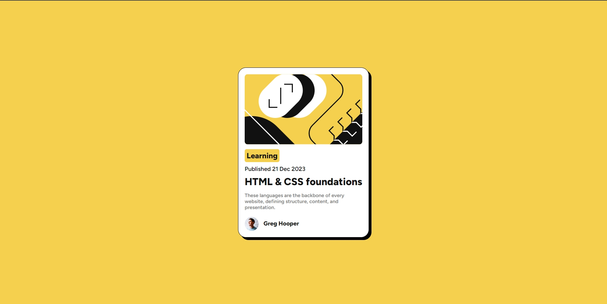

# Frontend Mentor - Blog preview card solution

This is a solution to the [Blog preview card challenge on Frontend Mentor](https://www.frontendmentor.io/challenges/blog-preview-card-ckPaj01IcS). Frontend Mentor challenges help you improve your coding skills by building realistic projects. 

## Table of contents

- [Overview](#overview)
  - [The challenge](#the-challenge)
  - [Screenshot](#screenshot)
  - [Links](#links)
- [My process](#my-process)
  - [Built with](#built-with)
  - [What I learned](#what-i-learned)
  - [Continued development](#continued-development)
- [Author](#author)

## Overview

### The challenge

Users should be able to:

- See hover and focus states for all interactive elements on the page

### Screenshot




### Links

- Live Site URL: [Github](https://r-ddle.github.io/Blog-Card-Preview/)

## My process

### Built with

- Semantic HTML5 markup
- CSS custom properties
- Flexbox

### What I learned

To contain a text inside a box and have the background properly fixed you need to remove the default header margin!

```css
* {
  margin: 0;
  padding: 0;
  box-sizing: border-box;
}
```

### Continued development

Should add some nice effects to make it look even better


## Author

- Website - [Riddle](https://www.your-site.com)
- Frontend Mentor - [@r-ddle](https://www.frontendmentor.io/profile/r-ddle)

